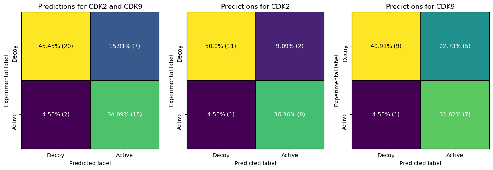

# Benchmarking Small Molecule Inhibitors for CDK2 and CDK9

This study presents a benchmark evaluation of 22 small molecules for their inhibitory potential against CDK2 and CDK9 protein kinases ([original study](https://kpfu.ru/uz-eng/ns/archive/uz-eng-ns-2021-4-1.html)). Experimentally determined IC50 values were used to classify compounds: those with IC50 < 100 µM were labeled as **active**, while those exceeding 100 µM were considered **inactive**.

The 3D protein-ligand models used for predictions were sourced from previous research. Ligand parameter files were generated from scratch, and the models were energy-minimized using the **minimizer app** implemented in the vScreenML framework. Features were then extracted, and the vScreenML score was computed to predict compound activity.

### **Results**
The overall accuracy of the vScreenML classification reached **79.54%**, with:
- **45.45%** of inactive compounds correctly classified  
- **34.09%** of active compounds correctly classified  
- **4.55%** misclassified as decoys  
- **15.91%** incorrectly predicted as active  

For CDK2-specific predictions, the model achieved **86.36% accuracy**, with:
- **1** model misclassified as a decoy  
- **2** models misclassified as actives  

For CDK9, the accuracy was slightly lower at **72.73%**, with:
- **1** model misclassified as a decoy  
- **5** models misclassified as actives  

