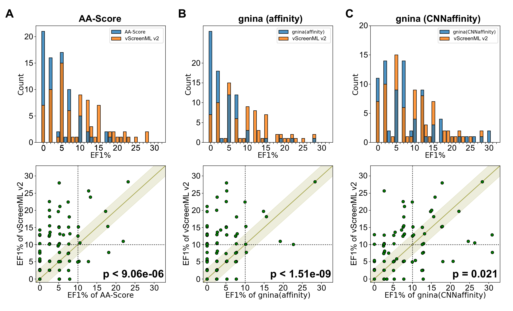

# Benchmarking DEKOIS2 Dataset

The DEKOIS2 dataset comprises 81 protein targets, each with 30-40 active compounds and 800-1200 decoy compounds. The structures were extracted from the supplemental data of the [KarmaDock](https://www.nature.com/articles/s43588-023-00511-5) and minimized using the minimizer app implemented in the vScreenML framework. Performance was measured using the enrichment factor of actives in the top 1% (EF1%) of predicted scores.

This study presents a benchmark evaluation of 22 small molecules for their inhibitory potential against CDK2 and CDK9 protein kinases . Experimentally determined IC50 values were used to classify compounds: those with IC50 < 100 µM were labeled as **active**, while those exceeding 100 µM were considered **inactive**.

The 3D protein-ligand models used for predictions were sourced from previous research. Ligand parameter files were generated from scratch, and the models were energy-minimized using the **minimizer app** implemented in the vScreenML framework. Features were then extracted, and the vScreenML score was computed to predict compound activity.

### **Results**

vScreenML 2.0 outperformed AA-Score and AutoDock Vina across most targets. Compared to GNINA CNNaffinity, vScreenML 2.0 demonstrated similar performance but with improved generalizability to novel protein targets.

AA-Score had more targets with very low EF1% values (0 to 7), whereas vScreenML 2.0 had more targets with higher EF1% values (10 and above). Extending the analysis to individual targets, there were some targets where both methods performed well. However, a larger number of points above the diagonal indicate that vScreenML 2.0 provided superior performance compared to AA-Score. Similarly, vScreenML 2.0 significantly outperformed AutoDock Vina.

Comparing vScreenML 2.0 to GNINA CNNaffinity showed similar performance in this experiment. The EF1% distributions indicate slightly more low values for GNINA CNNaffinity and slightly more high values for vScreenML 2.0. Examining the 81 individual targets, both methods yielded similar performance for 35 targets (absolute difference in EF1% < 3). Among the remaining 46 targets, vScreenML 2.0 was superior for 28, while GNINA CNNaffinity was superior for 18. 

